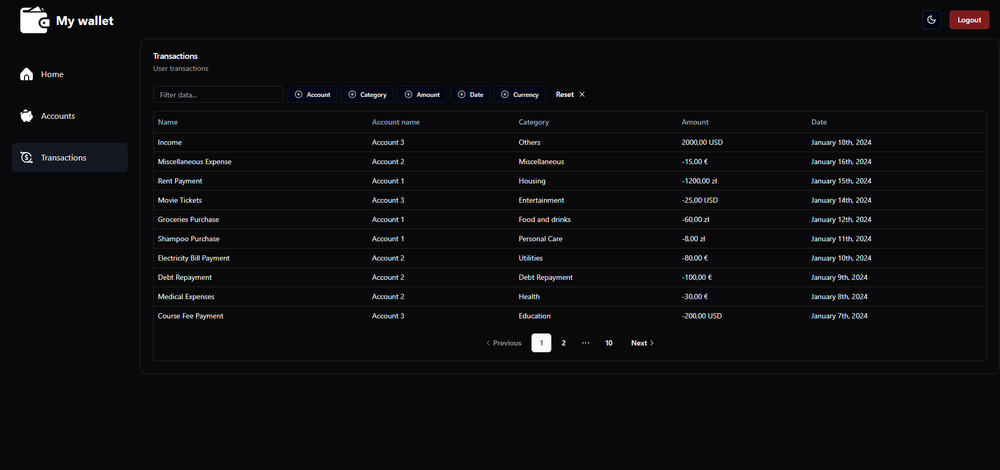
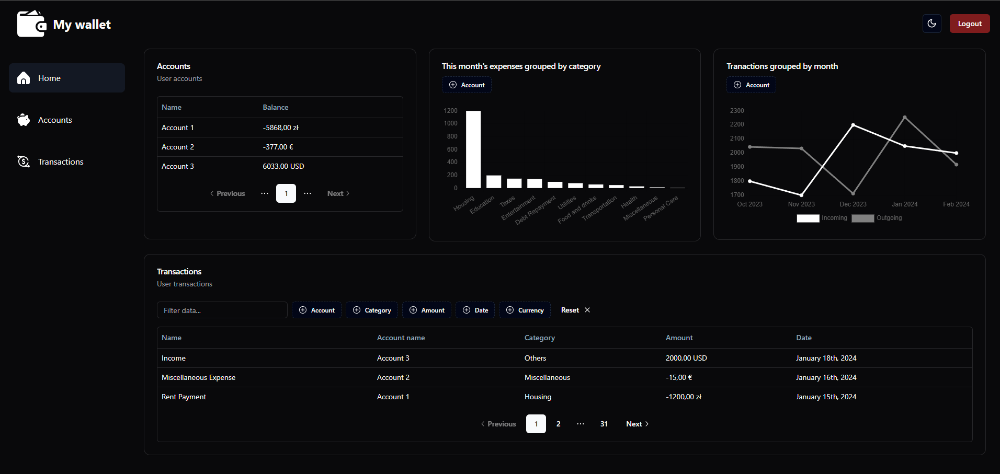

# My Wallet - Financial Management Application - UI


## Description

"My Wallet" is a web application created for the purpose of learning React, TypeScript, React Redux, Tanstack features and other modern web technologies. The main objective of the application is to allow users to manage their finances, track expenses and income, and gain expertise in these technologies. The project is in its early stages of development and may have limited functionality.

## Technologies

"My Wallet" application leverages the following technologies and tools:

* React: A JavaScript library for building user interfaces.
* TypeScript: A statically typed programming language. Used to 
* React Redux: A predictable state container for JavaScript apps.
* Tanstack Query: A library for fetching, caching, and updating asynchronous data in React.
* Shadcn: A library for creating UI components.
* Charts.js: A library for charts.

## Demo: https://my-wallet-alpha.d3j42aqo2b5x1h.amplifyapp.com/

## Backend Application

The backend for the "My Wallet" application is located in a separate repository. It is written in Node.js using the NestJs framework. You can access it at the following URL:

[My Wallet API Repository](https://github.com/Sosna213/MyWalletApi)

## Features

* User registration and login.
* Adding and deleting user accounts.
* Displaying a list of user accounts.
* Adding and deleting transactions.
* Displaying a list of transactions.
* Financial analysis using charts.
* Managing currencies for accounts (planned for the future).

## Application screenshots






## Installation

To install and run the "My Wallet" application on your local environment, follow these steps:

1. Clone the repository:

```
git clone https://github.com/Sosna213/my-vallet-ui-react.git
```
2. Navigate to the project directory:
```
cd my-wallet-ui-react
```
3. Install dependencies:
```
npm install
```
4. Start the application:
```
npm run dev
```
The application will be available at http://127.0.0.1:5173/ in your web browser.

## Author

Author: Mateusz Sosnowski
Contact: sosnowskimateusz25@gmail.com

## Status

The "My Wallet" project is in its early stages of development. New features and enhancements will be added as development progresses.

Thank you for using our application!  